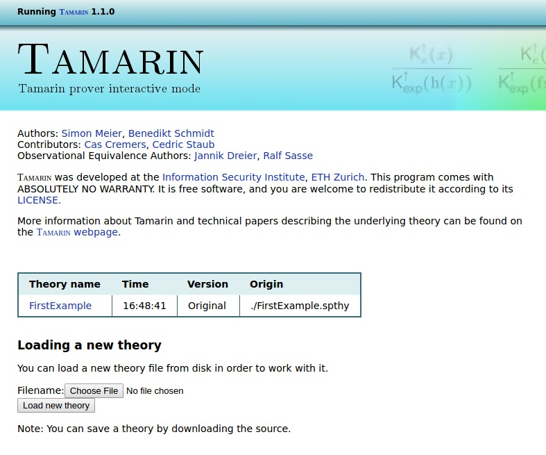

Initial Example
===============

We will start with a simple example of a protocol that only consists of two 
messages (given in Alice-and-Bob notation):

    C -> S: aenc{k}pk(S)
    C <- S: h(k)

In this protocol, a client C generates a fresh symmetric key 'k', encrypts it
with the public key of a server 'S' and sends it to 'S'. The server confirms
the receipt of the key by sending its hash back to the client.

This protocol is artificial and satisfies only very weak security
guarantees.  We will use it to illustrate the general Tamarin workflow
by proving that from the perspective of the client, the freshly
generated key is secret provided that the server is uncompromised.

The Tamarin modeling of this protocol and the security properties are given in 
the file [Tutorial](code/Tutorial.spthy) presented here:

~~~~ {.tamarin include="code/Tutorial.spthy"}
~~~~

Note that we use C-style comments. The Tamarin file starts with
`theory` followed by the name, here 'Tutorial'.  After the keyword
`begin`, we first declare function symbols, and equations that these
function symbols must satisfy. Then we declare multiset rewriting
rules that model the protocol, and finally we write lemmas that
specify the security properties. Moreover, we also inserted comments,
to structure the theory. Now, we describe these elements while
modeling this simple protocol in detail.

Function Signature and Equational Theory
----------------------------------------

TODO: WHY FUNCTIONS AND EQUATIONAL THEORY???

We model hashing using the unary function 'h'.
We model asymmetric encryption by declaring

  * a binary function 'aenc' denoting the encryption algorithm,
  * a binary function 'adec' denoting the decryption algorithm, and
  *  a unary function 'pk' denoting the algorithm computing a public
  key from a private key.

This is done by declaring the function symbols:

~~~~ {.tamarin slice="code/Tutorial.spthy" lower=15 upper=15}
~~~~

The equation 

~~~~ {.tamarin slice="code/Tutorial.spthy" lower=16 upper=16}
~~~~

models the interaction between calls to these three algorithms. All
such user-specified equations must be subterm-convergent rewriting
rules, when oriented from left to right. This means that the
right-hand-side must be a subterm of the left-hand-side or a nullary
function symbol (a constant).

Modeling the Public Key Infrastructure
--------------------------------------

Now, we introduce multiset rewriting rules modeling a public
key infrastructure (PKI):

~~~~ {.tamarin slice="code/Tutorial.spthy" lower=19 upper=22}
~~~~

The above rule models registering a public key. It makes use of the
following syntax.

Facts always start with an upper-case letter and do not have to be
declared.  If their name is prefixed with an exclamation mark `!`,
then they are persistent. Otherwise, they are linear. Note that every
fact name must be used consistently; i.e., it must always be used with
the same arity, casing, and multiplicity. Otherwise, Tamarin complains
that the theory is not wellformed.

The `Fr` fact is a built-in fact. It denotes a freshly generated fresh
name, used to model random numbers, i.e., nonces.  See later in this
manual for details.

We denote the sort of variables using prefixes:

 *    `~x`  denotes  `x:fresh`
 *    `$x`  denotes  `x:pub`
 *    `#i`  denotes  `i:temporal`
 *    `i`   denotes  `i:msg`

 and a string constant `'c'` denotes a public name `'c \in PN'`; i.e., a
 fixed, global constant

Thus, the above rule can be read as follows. First, freshly generate a
fresh name `~ltk`, the new private key, and nondeterministically choose
a public name `A`, the agent for which we are generating the key-pair.
Then, generate the persistent fact `!Ltk($A, ~ltk)`, which denotes the
association between agent `A` and its private key `~ltk`, and generate
the persistent fact `!Pk($A, pk(~ltk))`, which denotes the association
between the agent `A` and its public key `pk(~ltk)`.

We allow the adversary to retrieve any public key using the following
rule.  Intuitively, it just reads a public-key database entry and
sends the public key to the network using the built-in fact `Out`
denoting a message sent to the network. See later for more
information:

~~~~ {.tamarin slice="code/Tutorial.spthy" lower=24 upper=27}
~~~~

We model the dynamic compromise of long-term private keys using the
following rule. Intuitively, it reads a private-key database entry and
sends it to the adversary. This rule has an observable `LtkReveal`
action stating that the long-term key of agent `A` was compromised. We
will use this action in the security property below to determine which
agents are compromised.

~~~~ {.tamarin slice="code/Tutorial.spthy" lower=29 upper=32}
~~~~

Modeling the protocol
----------------------

Recall the Alice-and-Bob notation of the protocol we want to model:

  C -> S: aenc{k}pk(S)
  C <- S: h(k)

We model it using the following three rules.

~~~~ {.tamarin slice="code/Tutorial.spthy" lower=34 upper=65}
~~~~

Above, we model all applications of cryptographic algorithms
explicitly.  Call `tamarin-prover Tutorial.spthy` to inspect the
finite variants of the `Serv_1` rule, which list all possible
interactions of the destructors used.  In our proof search, we will
consider all these interactions.

We also model that the server explicitly checks that the first
component of the request is equal to `'1'`. We model this by logging
the claimed equality and then adapting the security property such that
it only considers traces where all `Eq` actions occur with two equal
arguments. Note that `Eq` is NOT a built-in fact. Guarded trace
properties are strong enough to formalize this requirement without
built-in support. Note that inequalities can be modeled analogously.

We log the session-key setup requests received by servers to allow
formalizing the authentication property for the client.

Modeling the security properties
--------------------------------

The syntax for specifying security properties is defined as follows:

 *  `All`      for universal quantification, temporal variables are prefixed with #
 *  `Ex`       for existential quantification, temporal variables are prefixed with #
 *  `==>`      for implication
 *  `&`        for conjunction
 *  `|`        for disjunction
 *  `not`      for  negation

*  `f @ i`    for action constraints, the sort prefix for the temporal variable 'i'
           is optional

 * `i < j`    for temporal ordering, the sort prefix for the temporal variables 'i'
           and 'j' is optional

 * `#i = #j`  for an equality between temporal variables 'i' and 'j'
 * `x = y`    for an equality between message variables 'x' and 'y'

CUT TEXT BELOW

Note that apart from public names (delimited using single-quotes), no terms
may occur in guarded trace properties. Moreover, all variables must be
guarded. The error message for an unguarded variable is currently not very
good.

For universally quantified variables, one has to check that they all
occur in an action constraint right after the quantifier and that the
outermost logical operator inside the quantifier is an implication.
For existentially quantified variables, one has to check that they all
occur in an action constraint right after the quantifier and that the
outermost logical operator inside the quantifier is a conjunction.
Note also that currently the precedence of the logical connectives is
not specified. We therefore recommend to use parentheses, when in
doubt.

Note that you can specify additional axioms that restrict the set of
considered traces. In this example, we restrict our attention to
traces where all equality checks succeed.

~~~~ {.tamarin slice="code/Tutorial.spthy" lower=68 upper=68}
~~~~

CUT TEXT ABOVE

The following two properties should be self-explanatory.
Note that the order between axioms and lemmas does not matter. All axioms are
always available/assumed in the proofs of all security properties.

~~~~ {.tamarin slice="code/Tutorial.spthy" lower=70 upper=95}
~~~~

Note that we can also strengthen the authentication property to a version of
injective authentication. Our formulation is stronger than the standard
formulation of injective authentication, as it is based on uniqueness instead
of counting. For most protocols, that guarantee injective authentication one
can also prove such a uniqueness claim, as they agree on appropriate fresh
data.

~~~~ {.tamarin slice="code/Tutorial.spthy" lower=97 upper=111}
~~~~

GO ON HERE...

Always have an "Exists-lemma":

~~~~ {.tamarin slice="code/Tutorial.spthy" lower=113 upper=118}
~~~~

Verification
------------

You can verify them by calling

    tamarin-prover --prove Tutorial.spthy

  This will first output some logging from the constraint solver and then the
  Tutorial security protocol theory with the lemmas and their attached
  (dis)proofs.

  Note that when adding inconsistent axioms, you can prove any property. To
  check that there still exist traces, you can state an 'exists-trace' lemma.
  When modeling protocols such existence proofs are very useful sanity checks.

  The following property must be provable, as otherwise there would be no
  possibility to setup a session key with a honest sever.

Running Tamarin on Tutorial
---------------------------

The call `tamarin-prover Tutorial.spthy` parses the `Tutorial.spthy`
file, computes the variants of the multiset rewriting rules, checks
their wellformedness (explained below), and pretty-prints the
theory. The declaration of the signature and the equations can be
found at the top of the pretty-printed theory.

Proving all lemmas contained in the theory is as simple as adding the
flag `--prove` to the call; i.e.,

  `tamarin-prover Tutorial.spthy --prove`

However, let's not go there yet. TODO: YES, GO THERE

Graphical User Interface
------------------------

Just call

    tamarin-prover interactive Tutorial.spthy

FIX: Syntax errors here?
    
This will start a web-server that loads all security protocol theories in the
same directory as Tutorial.spthy. Point your browser to

<http://localhost:3001>

and you will see the following welcome screen:

The table in the middle shows all loaded theories. You can either click on a 
theory to explore it and prove your security properties, or upload further 
theories using the upload form below.

If you click on the 'Tutorial' entry in the table of loaded theories, you 
should see the following:

On the left hand side you see the theory: links to the message theory 
describing the intruder, the multiset rewrite rules and axioms describing your 
protocol, and the typed and untyped case distinctions, followed by the lemmas 
you want to prove. We will explain each of these points in the following.

On the right hand side, you have a quick summary of the available commands and 
keyboard shortcuts you can use to navigate inside the theory.

If you click on "Message theory" on the left, you should see the following:

 

 

 
 You can prove a lemma
interactively by clicking on the available proof methods (corresponding to
applications of constraint reduction rules) or by calling the 'autoprover' by
right-clicking on a node in the theory overview. Note that that the proof
methods in the GUI are sorted according to our heuristic. Always selecting the
first proof method will result in the same proof as the ones constructed by
the 'autoprover' and '--prove'.

