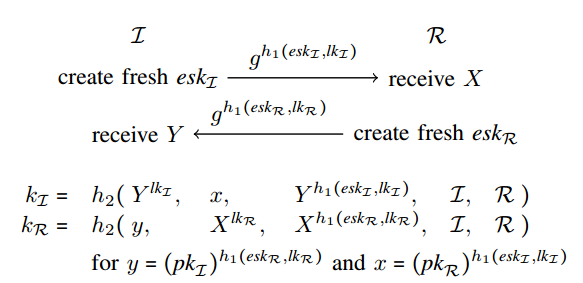

Model Specification
===================

In this manual, we provide an informal description of the underlying model. The
full details of the underlying model can be found in [@benediktthesis].

Models are specificity in Tamarin using three main ingredients:

   1. Rules
   2. Facts
   3. Terms

We have already seen the definition of terms in the previous section. Here we
will discuss facts and rules, and illustrate their use with respect to the Naxos
protocol, displayed below.

**FIX Cas: Picture should be updated and use vector graphics, ideally.**

In this protocol, Each party `x` has a long-term private key `lkx` and a
corresponding public key `pkx = g^lkx`, where `g` is a generator of the
Diffie-Hellman group. 

To start a session, the initiator `I` first creates a fresh nonce `eskI`, also
known as `I`’s ephemeral (private) key. He then concatenates eskI with `I`’s
long-term private key `lkI`, hashes the result using the hash function `h1`, and
sends `g^h1(eskI ,lkI )` to the responder. The responder `R` stores the received
value in a variable `X`, computes a similar value based on his own nonce `eskR`
and long-term private key `lkR`, and sends the result to the initiator, who
stores the received value in the variable `Y`. Finally, both parties compute a
session key (`kI` and `kR`, respectively) whose computation includes their own
long-term private keys, such that only the intended partner can compute the same
key.

Note that the messages exchanged are not authenticated, as the recipients cannot
verify that the expected long-term key was used in the construction of the
message. The authentication is implicit and only guaranteed through ownership of
the correct key. Explicit authentication (e.g., the intended partner was
recently alive or agrees on some values) is commonly achieved in authenticated
key exchange protocols by adding a key-confirmation step, where the parties
exchange a MAC of the exchanged messages that is keyed with (a variant of) the
computed session key.

Rules
-----

We use multiset rewriting to specify the concurrent execution of protocol and
adversary.  Multiset rewriting is a formalism that is commonly used to model
concurrent systems since it naturally supports independent transitions. 

A multiset rewriting system defines a transition system, which in our case will
be a labeled transition system. The state of the system is a multiset (bag) of
facts. We will explain the types of facts and their use below.

Tamarin's rewrite rules have a name, and sequences of facts as left-hand-sides,
labels, and right-hand-sides. For example:

**FIX Cas: Maybe better to use Naxos rules here.**

	MyRule1:
	[ ]--[ L(t) ]->[ F('1',t), F('2',t) ]

	MyRule2:
	[ F(u,v) ]--[ M(u,v) ]->[ H(t), G('3',h(t)) ]

For now, we will ignore the actions (`L(...)` and `M(...)`) and return to them
when discussing properties in the next section.

### Executions

The initial state of the transition system the empty multiset.

The rules define the way in which the system can transition to a new state. A
rule can be applied to a state if it can be instantiated such that its left hand
side is contained in the current state. In this case, the left-hand side facts
are removed from the state, and replaced by the right hand side.

For example, in the initial state, `MyRule1` can be instantiated for any value
of `t`. For any specific instantiation of `t`, this leads to a second state that
contains `F('1',t)` and `F('2',t)`. `MyRule2` can not be applied in the initial
state since it contains no `F` facts.

In each possible second state, both rules can now be applied. The second rule
can be instantiated either by `u` equal to `'1'` or to `'2'`, as long as `v` is
equal to the instantiation of `t` that occurred in the first transition, each
possible instantiation leading to next state.

Facts
-----

Facts are of the form `F(t1,...,tN)` for a fact symbol `F` and terms `tI`. They
have a fixed arity (in this case `N`). Note that i a Tamarin model uses the same
fact with two different arities, Tamarin will report an error.

There are three types of special facts built in to Tamarin. These are used to
model interaction with the untrusted network and to model the generation of
unique fresh (random) values.

`In`

:	This fact is used to model a party receiving a message from the
	untrusted network that is controlled by a Dolev-Yao adversary, and can
	occur on the left-hand side of a rewrite rule.

`Out`

:	This fact is used to model a party sending a message to the untrusted
	network that is controlled by a Dolev-Yao adversary, and can occur on
	the right-hand side of a rewrite rule.

`Fr`

:	This fact must be used when generating fresh (random) values, and can
	occur on the left-hand side of a rewrite rule, where its argument is the
	fresh term. Tamarin's underlying execution model has a built-in rule for
	generating `Fr(x)` facts, and also ensures that each instantiation of
	this rule produces a term that is different from all others.

For the above three facts, Tamarin has built-in rules. In particular, there is a
fresh rule that produces unique `Fr(...)` facts, and there is a set of rules for
adversary knowledge derivation, which consume `Out(...)` facts and produce
`In(...)` facts.

### Linear versus persistent facts

The facts that we have mentioned so far are called linear facts. They can be
produced but also be consumed by rules, and hence the might appear in one state
but not in the next.

In contrast, some facts in our models will never be removed from the state once
they are introduced. This would require that every rule that has such a fact in
the left-hand-side, will also have an exact copy of this fact in the right-hand
side.  While there is no fundamental problem with this modeling, it is
inconvenient for the user and it also might case Tamarin to explore rule
instantiations that are irrelevant for tracing such facts. 

For these two reasons, we introduce persistent facts. These are never removed
from the state, and we denote them by prefixing the fact with a bang (`!`).

FIX: use the following paragraph

Facts always start with an upper-case letter and do not have to be
declared explicitely. If their name is prefixed with an exclamation mark `!`,
then they are persistent. Otherwise, they are linear. Note that every
fact name must be used consistently; i.e., it must always be used with
the same arity, casing, and multiplicity. Otherwise, Tamarin complains
that the theory is not wellformed.

Modeling protocols
------------------

There are several ways in which the execution of security protocols can be
defined, e.g., as in [@opsem2012]. In Tamarin, there is no pre-defined protocol
concept  and the user is free to model them in the preferred way. Below we give
one example of how protocols can be modeled and discuss alternatives afterwards.

### Public-key infrastructure

**FIX Cas: this might well be duplicating a part from elsewhere.**

In the Tamarin model, there is no pre-defined notion of public key
infrastructure (PKI). A pre-distributed PKI with asymmetric keys for each party
can be modeled by a single rule that generates a key for a party. The party's
identity and public/private keys are then stored as facts in the state, enabling
protocol rules to retrieve them. For the public key, we commonly use the `Pk`
fact, and for the corresponding private key we use the `Ltk` fact. Since these
facts will only be used by other rules to retrieve the keys, but never updated,
we model them as persistent facts. We use the abstract function `pk(x)` to
denote the public key corresponding to the private key `x`, leading to the
following rule.

	[ Fr(~x) ]--[ ]->[ !Pk($A,pk(~x)), !Ltk($A,~x) ]

**FIX Cas: for the above rule, need to point out relation to builtins**

**FIX Cas: what about signatures and builtins**

Some protocols, such as Naxos, rely on the algebraic properties of the key
pairs. In many DH-based protocols, the public key is $g^x$ for the private key
$x$, which enables exploiting the commutativity of the exponents to establish
keys. In this case, we model the following rule.

	[ Fr(~x) ]--[ ]->[ !Pk($A,'g'^~x)), !Ltk($A,~x) ]

### Modeling a protocol step

Protocols describe the behaviour of agents in the system. Agent can perform
protocol steps, such as receiving a message and responding by sending a message,
or starting a session.

### Modeling the Naxos responder role

We first model the responder role, which is easier since it can be done in one
rule.

Each time a responder thread of an agent receives a message, it will generate a
fresh value `eskR`, send a response message, and compute a key $kR$

**FIX Cas: need to do either pattern matching or explicit construct/deconstruct;
not a big deal for naxos, but should pop up somewhere**

Alternative modeling approaches
-------------------------------

**FIX Cas: splitting send/receive, etc.**

**FIX Cas: pattern matching vs deconstructors**

TODO:
  * Example use-cases for variable annotations ($ ~), and any caveats that
    might come with them (like if incorrect ~ use can make things unsound)

  * An explanation/examples of the difference between K, KU, and KD, and when
    you would use each.

