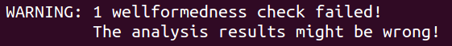

Modeling Issues {#sec:modeling-issues}
===============

TODO: Explain common errors and misconceptions and how to avoid them

First-time users
----------------
In this section we discuss some problems that a first-time user might face.
This includes some error messages and what you can do in order to fix them. 

Also, we discuss how one can find out that a protocol specification does 
not model the protocol that was intended and how one can avoid this with 
`exists-trace` lemmas.

For illustrating these concepts, consider the following protocol, where an
initiator `$I` and a receiver `$R` share a symmetric key `~k`.
`$I` then sends the message `~m`, encrypted with their shared key `~k` to `$R`.

~~~~ {.tamarin slice="code/FirstTimeUser.spthy" lower=12 upper=33}
~~~~

With the lemma `nonce_secret` we examine if the message is secret from the
perspective of the receiver.

### Exist-Trace Lemmas ### 

Imagine that in the setup rule you forgot the agent state fact for the receiver
`AgSt($R,~k)` as follows:

~~~~ {.tamarin slice="code/FirstTimeUser_Error1.spthy" lower=16 upper=20}
~~~~

With this, Tamarin verifies the lemma `nonce_secret`.
The lemma says that whenever the action `Secret(R,m)` is reached in a trace,
then the adversary does not learn `m`. However, in the modified specification
the rule `R_1` will never be executed. Consequently there will never be an
action `Secret(R,m)` in the trace. For this reason the lemma is always vacuously true
and verifying the lemma does not mean that the protocol that we intended has
this property.
To avoid the case of proving a lemma but with an empty protocol, we define
`exist-trace` lemmas.

With such a lemma we define what functionality we want to achieve in a 
protocol.
In the above example the goal is that first an initiator sends a message and 
that then the receiver receives the same message. 
We express this with the following lemma:

~~~~ {.tamarin slice="code/FirstTimeUser.spthy" lower=34 upper=38}
~~~~

If we evaluate this lemma with Tamarin in the model with the error it will be falsified. This indicates
that there exists no trace where the initiator sends a message to the receiver.
Often, this is the case if we forget to add a fact that connects several rules 
and some rules can never be reached. 
Generally it is recommended to add an `exists-trace` lemma to make sure the
protocol provides the functionality wanted before more properties are examined.

### Error Messages ###
In this section we will intentionally add some mistakes to the above protocol 
to go through some common error messages of Tamarin.
We will always present one modified rule and a corresponding error message and 
then explain what the error message means. 
In practice, this can help in understanding error messages that one gets
when specifying a new protocol.

### Inconsistent Fact usage ###

First we change the setup rule as follows:

~~~~ {.tamarin slice="code/FirstTimeUser_Error2.spthy" lower=16 upper=20}
~~~~

The following statement that some wellformedness check failed will
appear at the very end of the text when loading this theory.

This indicates that there might be a problem. However, for getting more 
information, one has to scroll up in the command line.

The problem lists all the fact usages of fact `AgSt`.
The statement `1. rule 'setup', fact "agst":("AgSt",3,Linear)` means that
in the rule `setup` the fact `AgSt` is used as a linear fact with 3 arguments.
This is not consistent with its use in other rules. For example 
`2. rule 'setup', fact "agst": ("AgSt",2,Linear)` indicates that it is also 
used with 2 arguments in the `setup` rule.
To solve this problem we have to make sure that we only use the same fact with 
the same number of arguments.

### Unbound variables ###

If we change the rule `R_1` to

~~~~ {.tamarin slice="code/FirstTimeUser_Error3.spthy" lower=26 upper=30}
~~~~

we get the error message

The warning `unbound variables` indicates that there is a term, here the fresh 
`~n`, in the action or conclusion that never appeared in the premisse. 
Here this is the case because we mistyped `~n` instead of `~m`. Generally,
if such a warning appears one should make sure that all the fresh variables 
variables already occur in the premise. If it is a fresh variable that appears
for the first time in this rule, a `Fr(~n)` fact should be added to the 
premise.

### Free Term in formula ###

Next, we change the functional lemma as follows

~~~~ {.tamarin slice="code/FirstTimeUser_Error4.spthy" lower=34 upper=38}
~~~~

This causes the following warning:

The warning indicates that in this lemma the term `m` is occurs free. This
means that it is not bound to any quantifier. Often such an error occurs if
one forgets to list all the variables that are used in the formula after the
`Ex` or `All` quantifier. In our example the problem occured because we deleted the `m` in `Ex I R m #i #j.` 

### Undefined Action Fact in Lemma ###

Next, we change the lemma `nonce_secret` and get the following warning:

~~~~ {.tamarin slice="code/FirstTimeUser_Error5.spthy" lower=31 upper=33}
~~~~

Such a warning always occurs if a lemma uses a fact that never appears as an
action fact in any rule.
The cause of this is either that the fact is spelled differently (here
`Secr` instead of `Secret`) or that one forgot to add the action fact to the
protocol rules. 
Generally, it is a good advice to double check that the facts that are used in
the lemmas are appearing in the relevant protocol rules as actions.

### Undeclared function symbols ###

If we omit the line 

~~~~ {.tamarin slice="code/FirstTimeUser.spthy" lower=12 upper=12}
~~~~

the following warning will be output

The warning indicates that Tamarin did not expect opening brackets. This means,
that a function is used that Tamarin does not recognize.  
This can be the case if a function `f` is used that has not been declared with
`functions: f/1`. Also, this warning occurs if a built in function is used but
not declared. 
Here in the example the problem arises because we used the symmetric 
encryption `senc`, but omitted the line where we declare that we use this
built-in function.

### Inconsistent sorts ###

If we change the `setup` rule to 

~~~~ {.tamarin slice="code/FirstTimeUser_Error7.spthy" lower=16 upper=20}
~~~~

we get the error message

This indicates that the sorts of a message was not used consistently.
In the rule `setup` this is the case because we once used m as a fresh value
`~m` and once without the `~`.

TODO: any important error messages missing?

### why not doing anything ###
open chains

### functions ###
function-> where does it go? doesn have support:
local to rule with "let"

 

Using rewrite rules to 'share'
------------------------------

TODO: Katriel?
