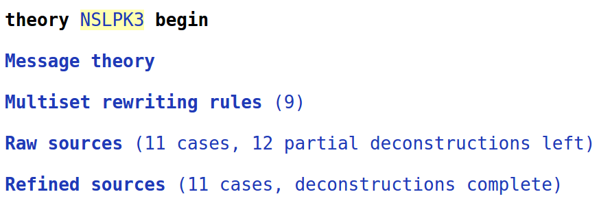
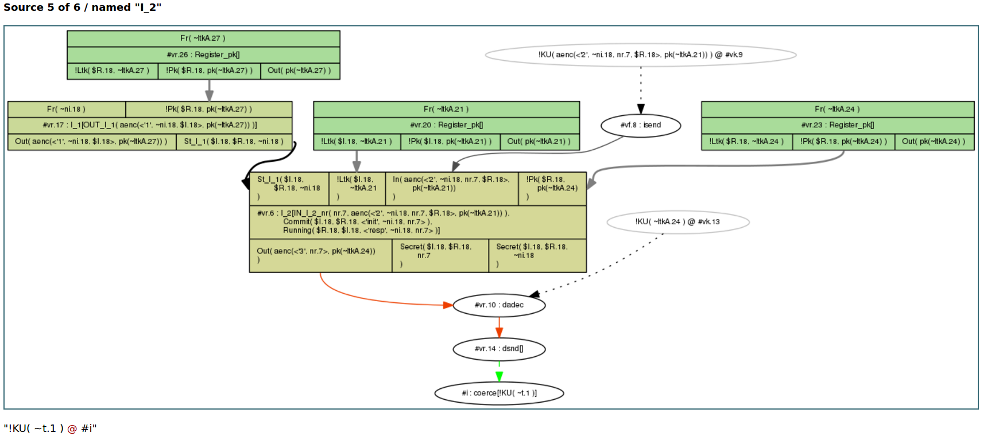

Precomputation: refining sources {#sec:precomputation}
==============

In this section, we will explain some of the aspects of the
precomputation performed by Tamarin.  This is relevant for users that
model complex protocols since they may at some point run into so-called
remaining [partial deconstructions](#sec:openchains), which can be
problematic for verification.

To illustrate the concepts, consider the example of the Needham-Schroeder-Lowe
Public Key Protocol, given here in Alice&Bob notation:

~~~~ {.tamarin slice="code/NSLPK3.spthy" lower=24 upper=29}
~~~~

It is specified in Tamarin by the following rules:

~~~~ {.tamarin slice="code/NSLPK3.spthy" lower=32 upper=71}
~~~~

We now want to prove the following lemma:

~~~~ {.tamarin slice="code/NSLPK3.spthy" lower=105 upper=118}
~~~~

This proof attempt will not terminate due to there being `12 partial
deconstructions left` when looking at this example in the GUI as
described in detail below.

Partial deconstructions left {#sec:openchains}
-----------

In the precomputation phase, Tamarin goes through all rules and inspects their
premises. For each of these facts, Tamarin will precompute a set of possible
*sources*. Each such source represents
combinations of rules from which the fact could be obtained.  For each fact,
this leads to a set of possible sources and we refer to these sets as the *raw sources*, respectively *refined sources*.

However, for some rules Tamarin cannot resolve where a fact must have come from.
We say that a partial deconstruction is left in the raw sources, and we will explain them in more detail
below.

The existence of such partial deconstructions  complicates automated proof generation and
often (but not always) means that no proof will be found automatically.  For
this reason, it is useful for users to be able to find these and examine
if it is possible to remove them.

In the interactive mode you can find such partial deconstructions as follows.  On the top left,
under "Raw sources", one can find the precomputed sources
by Tamarin.


{ width=80% }\

Cases with partial deconstructions will be listed with the text `(partial deconstructions)`
after the case name. The partial deconstructions can be identified by light green arrows in the
graph, as in the following example:

{ width=100% }\

The green arrow indicates that Tamarin cannot exclude the possibility that the
adversary can derive any fresh term `~t.1` with this rule `I_2`.  As we are
using an untyped protocol model, the tool cannot determine that `nr.7` should be
a fresh nonce, but that it could be any message. For this reason Tamarin
concludes that it can derive any message with this rule.

<!--**FIX Cas: In the above, we mention untyped protocol model. Did we explain
this?**-->

### Why partial deconstructions complicate proofs

To get a better understanding of the problem, consider  what happens if
we try to prove the lemma `nonce_secrecy`.  If we manually always choose
the first case for the proof, we can see that Tamarin derives the secret key to
decrypt the output of rule `I_2` by repeatedly using this rule `I_2`.
More specifically, in `a)` the output of rule `I_2` is decrypted by the
adversary. To get the relevant key for this, in part `b)` again the output
from rule `I_2` is decrypted by the adversary. This is done with a key coming
from part `c)` where the same will happen repeatedly.

{ width=90% }\

As Tamarin is unable to conclude that the secret key could not have come from
the rule `I_2`, the algorithm derives the secret key that is needed. The proof
uses the same strategy recursively but will not terminate.


Using Sources Lemmas to Mitigate Partial Deconstructions
-------------------------------------

Once we identified the rules and cases in which partial deconstructions occur, we
can try to avoid them. A good mechanism to get rid of partial deconstructions is the use of
so-called *sources lemmas*.

Sources lemmas are a special case of lemmas, and are applied
during Tamarin's pre-computation. Roughly, verification in Tamarin involves
the following steps:

  1. Tamarin first determines the possible sources of all premises. We call these the
     raw sources.

  2. Next, automatic proof mode is used to discharge any sources lemmas using induction.

  3. The sources lemmas are applied to the raw sources, yielding a
     new set of sources, which we call the refined sources.

  4. Depending on the mode, the other (non-sources) lemmas are now considered
     manually or automatically using the refined sources.

For full technical details, we refer the reader to [@meierthesis], where these are called type assertions.

In our example, we can add the following lemma:

~~~~ {.tamarin slice="code/NSLPK3.spthy" lower=86 upper=102}
~~~~

This sources lemma is applied to the raw sources to compute the
refined sources. All non-sources lemmas are proven with the resulting
refined sources, while sources lemmas must be proved with
the raw sources.

This lemma relates the point of instantiation to the point of sending by either
the adversary or the communicating partner. In other words, it says that
whenever the responder receives the first nonce, either the nonce was known to
the adversary or the initiator sent the first message prior to that moment.
Similarly, the second part states that whenever the initiator receives the
second message, either the adversary knew the corresponding nonce or the
responder has sent the second message before.
Generally, in a protocol with partial deconstructions left it is advisable to try if the problem
can be solved by a sources lemma that considers where a term could be coming
from.
As in the above example, one idea to do so is by stating that a used term must
either have occurred in one of a list of rules before, or it must have come
from the adversary.

The above sources lemma can be automatically proven by Tamarin. With the sources
lemma, Tamarin can then automatically prove the lemma `nonce_secrecy`.


Another possibility is that the partial deconstructions only occur in an undesired
application of a rule that we do not wish to consider in our model.
In such a case, we can explicitly exclude this application of the rule
with a restriction. But, we should ensure that the resulting model is the
one we want; so use this with care.

## Modelling tricks to Mitigate Partial Deconstructions

Sometimes partial deconstructions can be removed by applying some modelling tricks:

1. If the deconstruction reveals a term `t` that, intuitively, can be made
   public anyway, you can add `In(t)` to the lhs of the rule. If you are not
   sure if this transformation is sound, you may write a lemma to ensure that
   the rule can still fire.

   Example: Counter values are public knowledge, so adding `In(c)` to the
   second rule helps here:

   ```
   [] --> [Counter('1')]

   [Counter(c)] --> [Counter(c+'1'), Out(c+'1')]

   ```

2. Give fresh or public type if you know some values are atomic, but you see
   that pre-computation tries to deduce non-atomic terms from them.  This works
   only under the assumption that the implementation can enforce the correct
   assignment, e.g., by appropriate tagging.

3. Using pattern matching instead of destructor functions can help distill the
   main argument of a proof in the design phase or in first stages of
   modelling. It is valid, and often successful strategy to start with
   a simplistic modelling and formulate provable lemmas first, and then proceed
   to refine the model step by step.

Auto-Sources {#sec:autosources}
-----------

Tamarin can also try to automatically generate sources lemmas [@esorics2020]. To
enable this feature, Tamarin needs to be started using the command line
parameter ``--auto-sources``.

When Tamarin is called using ``--auto-sources``, it will check, for each theory
it loads, whether the theory contains partial deconstructions, and whether there
is a sources lemma. If there are partial deconstructions and there is no sources
lemma, it will try to automatically generate a suitable lemma, called
``AUTO_typing``, and added to the theory's list of lemmas.

This works in many cases, note however that there is no guarantee that the
generated lemma is (i) sufficient to remove all partial deconstructions and (ii)
correct - so you still need to check whether all partial deconstructions are
resolved, and to prove the lemma's correctness in Tamarin, as usual.

Cases where Tamarin may fail to generate a sufficient or correct sources lemma
include in particular theories using non subterm convergent equations or AC
symbols, or cases where partial deconstruction stem from state facts rather
than inputs and outputs.

To be able to add the sources lemma, Tamarin needs to modify the protocol rules
of the loaded theory in two ways:

1. By adding the necessary annotations which will be used in the lemma to the
   protocol rules. All added annotations start with ``AUTO_IN_`` or
   ``AUTO_OUT_``, and can be seen, e.g., by clicking on
   ``Multiset rewriting rules`` in interactive mode.
2. By splitting protocol rules into their variants w.r.t. the equational theory,
   if these variants exists. This is necessary to be able to place the
   annotations. When exporting such a theory from Tamarin using, e.g., the
   ``Download`` button in the interactive mode, Tamarin will export the rule(s)
    together with their (annotated) variants, which can be re-imported as usual.

Limiting Precomputations {#sec:limitingPrecomputations}
-----------

Sometimes Tamarin's precomputations can take a long time, in particular if there are many open chains or the saturation of sources grows too quickly.

In such a case two command line flags can be used to limit the precomputations:

- `--open-chains` or `-c` limits the number of chain goals Tamarin will solve during precomputations. In particular, this value stops Tamarin from solving any deconstruction chains that are longer than the given value. This is useful as some equational theories can cause loops when solving deconstruction chains. At the same time, some equational theories may need larger values (without looping), in which case it can be necessary to increase this value. However, a too small value can lead to sources that contain open deconstruction chains which would be easy to solve, rendering the precomputations inefficient.
Tamarin shows a warning on the command line when this limit is reached.
Default value: 10

- `--saturation` or `--s` limits the number of saturation steps Tamarin will do during precomputations. In a nutshell, Tamarin first computes sources independently, and then saturates them (i.e., applies each source to all other sources if possible) to increase overall efficiency. However, this can sometimes grow very quickly, in which case it might be necessary to fix a smaller value.
Default value: 5

In case Tamarin's precomputations take too long, try fixing smaller values for both parameters, and analyze the sources shown in interactive mode to understand what exactly caused the problem.
