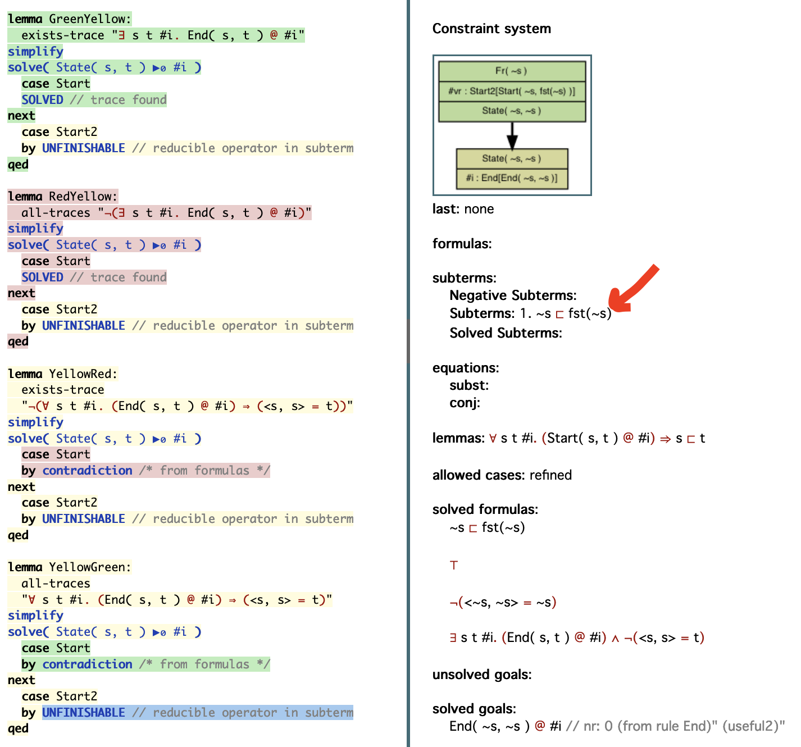

Advanced Features {#sec:advanced-features}
=================

We now turn to some of Tamarin's more advanced features.
We cover custom heuristics, the GUI, channel models, induction, internal
preprocessor, and how to measure the time needed for proofs.
<!--manual proofs,encoding tricks,-->

Heuristics {#sec:heuristics}
----------

A heuristic describes a method to rank the open constraints of a constraint system and is specified as a sequence of proof method rankings.
Each proof method ranking is abbreviated by a single character from the set `{s,S,c,C,i,I,o,O}`.

A global heuristic for a protocol file can be defined using the `heuristic:` statement followed by the sequence of proof method rankings.
The heuristic which is used for a particular lemma can be overwritten using the `heuristic` lemma attribute.
Finally, the heuristic can be specified using the `--heuristic` command line option.

\pagebreak

The precedence of heuristics is:

1. Command line option (`--heuristic`)
2. Lemma attribute (`heuristic=`)
3. Global (`heuristic:`)
4. Default (`s`)

The proof method rankings are as follows.

`s`:
: the 'smart' ranking is the ranking described in the extended version of
  our CSF'12 paper. It is the default ranking and works very well in a wide
  range of situations. Roughly, this ranking prioritizes chain constraints,
  disjunctions, facts, actions, and adversary knowledge of private and
  fresh terms in that order (e.g., every action will be solved before any
  knowledge constraint). Constraints marked 'Probably Constructable' and
  'Currently Deducible' in the GUI are lower priority.

`S`:
: is like the 'smart' ranking, but does not delay the solving of premises
  marked as loop-breakers. What premises are loop breakers is determined
  from the protocol using a simple under-approximation to the vertex
  feedback set of the conclusion-may-unify-to-premise graph. We require
  these loop-breakers for example to guarantee the termination of the case
  distinction precomputation. You can inspect which premises are marked as
  loop breakers in the 'Multiset rewriting rules' page in the GUI.

`c`:
: is the 'consecutive' or 'conservative' ranking. It solves constraints in the
  order they occur in the constraint system. This guarantees that no constraint
  is delayed indefinitely, but often leads to large proofs because some
  of the early constraints are not worth solving.

`C`:
: is like 'c' but without delaying loop breakers.

`i`:
: is a ranking developed to be well-suited to injective stateful protocols.
  The priority of proof methods is similar to the 'S' ranking, but instead of a
  strict priority hierarchy, the fact, action, and knowledge constraints are
  considered equal priority and solved by their age. This is useful for
  stateful protocols with an unbounded number of runs, in which for example
  solving a fact constraint may create a new fact constraint for the previous protocol
  run. This ranking will prioritize existing fact, action, and knowledge constraints
  before following up on the fact constraint of that previous run. In contrast the 'S'
  ranking would prioritize this new fact constraint ahead of any existing action or
  knowledge constraint, although solving the new constraint may create yet another
  earlier fact constraint and so on, preventing termination.

`I`:
: is like 'i' but without delaying loop breakers.

`{.}`:
: is the tactic ranking. It allows the user to provide an arbitrary ranking for the proof methods, specified in a language native to Tamarin. Each tactic needs to be given a name. For the tactic named `default`, the call would be `{default}`.
The syntax of the tactics will be detailed below in the part `Using a tactic`. However, for a quick overview, a tactic is composed of several fields. The first one, `tactic`, specifies the name of the tactic and is mandatory. Then `presort` (optional) allows the user to choose the base ranking of the input. The keywords `prio` and `deprio` defines the ranks of the proof methods. They gather functions that will recognize the constraints. The higher the prio that recognizes a constraint, the sooner it will be treated and the lower the deprio, the later. The user can choose to write as much of prio or deprio as needed. A tactic can also be composed of only prio or deprio. The functions are preimplemented and allow to reach information unavailable from oracle (the state of the system or the proof context).

`o`:
: is the oracle ranking. It allows the user to provide an arbitrary program
  that runs independently of Tamarin and ranks the proof methods.
  The path of the program can be specified after the proof method ranking, e.g., `o "oracles/oracle-default"`
  to use the program `oracles/oracle-default` as the oracle.
  If no path is specified, the default is `oracle`.
  The path of the program is relative to the directory of the protocol file containing the proof method ranking.
  If the heuristic is specified using the `--heuristic` option, the path can be given using the
  `--oraclename` command line option. In this case, the path is relative to the current working directory.
  The oracle's input is a numbered list
  of proof methods, given in the 'Consecutive' ranking (as generated by the heuristic `C`).
  Every line of the input is a new constraint and starts with "%i: ", where %i is the
  index of the constraint. The oracle's output is expected to be a line-separated list of
  indices, prioritizing the given proof methods. Note that it suffices to output
  the index of a single proof method, as the first ranked proof method will always be selected.
  Moreover, the oracle is also allowed to terminate without printing a valid index.
  In this case, the first proof method of the 'Consecutive' ranking will be selected.

`O`:
: is the oracle ranking based on the 'smart' heuristic `s`. It works the same as `o` but uses 'smart' instead of 'Consecutive' ranking to start with.

`p`:
: is the SAPIC-specific ranking. It is a modified version of the smart `s`
heuristic, but resolves SAPIC's `state`-facts right away, as well as Unlock
constraints, and some helper facts introduced in SAPICs translation (`MID_Receiver`,
`MID_Sender`).
`Progress_To` constraints (which are generated when using the optional
[local progress](006_protocol-specification-processes.html#sec:local-progress))
are also prioritised.
Similar to [fact annotations]( #sec:fact-annotations ) below,
this ranking also introduces a prioritisation for `Insert`-actions
When the first element of the key
is prefixed `F_`, the key is prioritized, e.g.,  `lookup <F_key,p> as v in ...`.
Using `L_` instead of `F_` achieves deprioritsation.
Likewise, names and be (de)prioritized by prefixes them in the same manner.
See [@KK-jcs16] for the reasoning behind this ranking.

`P`:
: is like `p` but without delaying loop breakers.

If several rankings are given for the heuristic flag, then they are employed
in a round-robin fashion depending on the proof-depth. For example, a flag
`--heuristic=ssC` always uses two times the smart ranking and then once the
'Consecutive' proof method ranking. The idea is that you can mix proof method rankings easily
in this way.

Fact annotations {#sec:fact-annotations}
-------------------

Facts can be annotated with `+` or `-` to influence their priority in heuristics.
Annotating a fact with `+` causes the tool to solve instances of that fact
earlier than normal, while annotating a fact with `-` will delay solving those
instances.
A fact can be annotated by suffixing it with the annotation in square
brackets. For example, a fact `F(x)[+]` will be prioritized, while a fact
`G(x)[-]` will be delayed.

Fact annotations
apply only to the instances that are annotated, and are not considered during
unification. For example, a rule premise containing `A(x)[+]` can unify
with a rule conclusion containing `A(x)`. This allows multiple instances
of the same fact to be solved with different priorities by annotating them
differently.

The `+` and `-` annotations can also be used to prioritize actions.
For example, A reusable lemma of the form
```
    "All x #i #j. A(x) @ i ==> B(x)[+] @ j"
```
will cause the `B(x)[+]` actions created when applying this lemma
to be solved with higher priority.

Heuristic priority can also be influenced by starting a fact name with `F_`
(for first) or `L_` (for last) corresponding to the `+` and `-` annotations
respectively. Note however that these prefixes must apply to every instance
of the fact, as a fact `F_A(x)` cannot unify with a fact `A(x)`.

Facts in rule premises can also be annotated with `no_precomp` to prevent the
tool from precomputing their sources.
Use of the `no_precomp` annotation in key places can be very
useful for reducing the precomputation time required to load large models, however
it should be used sparingly. Preventing the precomputation of sources for a premise
that is solved frequently will typically slow down the tool, as it must solve the
premise each time instead of directly applying precomputed sources. Note also that
using this annotation may cause partial deconstructions if the source of a premise
was necessary to compute a full deconstruction.

The `no_precomp` annotation can be used in combination with heuristic annotations
by including both separated by commas---e.g., a premise
`A(x)[-,no_precomp]` will be delayed and also will not have its sources precomputed.

### Using a Tactic {subsec: tactic}

The tactics are a language native to Tamarin designed to allow user to write custom rankings of proof methods.

#### Writing a tactic

In order to explain the way a tactic should be written, we will use the simple example (theory SourceOfUniqueness).
The first step is to identify the tactic by giving it a name (here uniqueness). Then you can choose a `presort`. It has the same role as the c or C option but with more options. Depending on whether you are using the diff mode are not, you will respectively be able to choose among 's', 'S', 'c' and 'C' and 'C', 'I', 'P', 'S', 'c', 'i', 'p', 's'. Note that this field is optional and will by default be set at `s`.

```
tactic: uniqueness
presort: C
```

Then we will start to write the priorities following which we want to order the proof methods. Every priority, announced by the `prio`  keywords, is composed of functions that will try to recognize characteristics in the proof methods given by Tamarin. If a proof method is recognized by a function in a priority, it will be be ranked as such, i.e., the higher the priority in the tactic, the higher the proof methods it recognizes will be ranked. The particularity recognized by every function will be detailed in a paragraph below. The tactic language authorizes to combine functions using `|`, `&` and `not`.
Even if the option is not necessary for the proof of the lemma uniqueness, let's now explore the `deprio` keyword. It works as the `prio` one but with the opposite goal since it allows the user to put the recognized proof methods at the bottom of the ranking. In case several `deprio` are written, the first one will be ranked higher than the last ones. If a proof method is recognized by two or more 'priorities' or 'depriorities', only the first one (i.e., the higher rank possible) will be taken into account for the final ranking.
The order of the proof methods recognized by the same priority is usually predetermined by the presort. However, if this order is not appropriate for one priority, the user can call a 'postranking function'. This function will reorder the proof methods inside the priority given a criteria. If no postranking function is determined, Tamarin will use the identity. For now, the only other option is `smallest`, a function that will order the proof methods by increasing size of their pretty-printed strings.

```
prio:
    isFactName "ReceiverKeySimple"
prio:
    regex "senc\(xsimple" | regex "senc\(~xsimple"
prio: {smallest}
    regex "KU\( ~key"
}
```


#### Calling a tactic

Like the other heuristics, tactics can be called two ways. The first one is using the command line. In the case study above, it would be: `tamarin-prover --prove --heuristic={prove=uniqueness} SourceOfUniqueness.spthy`.
The other way is directly integrated in the file by adding `[heuristic={uniqueness}]` next to the name of the lemma that is supposed to use it. The option does not need to be called again from the command line. The second option is helpful when working with a file containing several tactics used by different lemmas.

#### Ranking functions

The functions used in the tactic language are implemented in Tamarin. Below you can find a list of the currently available functions. At the end at this section, you will find an explanation on how to write your own functions if the one described here do not suffice for your usage.

Pre-implemented functions
    * `regex`: as explain above, this function takes in parameter a string and will use it as a pattern to match against the proof methods. (Since it is based on the Text.Regex.PCRE module of Haskell, some characters, as the parenthesis, will need to be escaped to achieve the desired behavior).
    * `isFactName`: as is given by its name, this function will go look in the Tamarin object 'goal' and check if the field FactName matches its parameter. To give an example of its usage, `isFactName` could be used instead of `regex` for the first prio of the above example with same results.
    * `isInFactTerms`: the function will look in the list contained in the field FactTest whether an element corresponding the parameter can be found.
The following functions are also implemented but specifically designed to translate the oracles of the Vacarme tool into tactics:
    * `dhreNoise`: recognize constraints containing a Diffie-Hellman exponentiation. For example, the constraint `Recv( <'g'^~e.1,aead(kdf2(<ck, 'g'^(~e*~e.1)>), '0', h(<hash, 'g'^~e.1>), peer),aead(kdf2(<kdf1(<ck, 'g'^(~e*~e.1)>), z>), '0',h(<h(<hash, 'g'^~e.1>),aead(kdf2(<ck, 'g'^(~e*~e.1)>), '0', h(<hash, 'g'^~e.1>), peer)>), payload)>) ▶₁ #claim` is recognized thanks to the presence of the following pattern `'g'^~e.1`. The function does need one parameter from the user, the type of oracle it is used for. It can be `def` for the Vacarme default case, `curve` for Vacarme oracle_C25519_K1X1 case and `diff` if the tactic is used to prove an equivalence lemma. If the parameter specified is anything else, the default case will be used.
    It works as follows. First, it will retrieve from the system state the formulas that have the `Reveal` fact name and matches the regex `exp\\('g'`. For the retrieved formulas, it will then put in a list the content of the `Free` variables along the variable `~n`. In the case of the example given above, the list would be `[~n,~e,~e.1]`. They are the variable that the function will try to match against. Once it is done, the tested constraint will be recognized if it includes an exponentiation that uses the previously listed elements (just one as exponent or a multiplication).  
    * `defaultNoise`: this function takes two parameter: the oracle type (as explained for `dhreNoise`) and a regex pattern. The regex pattern should allow the program to extract the nonces targeted by the user from the constraint. For example, in the default case of Vacarme, the regex is `(?<!'g'\^)\~[a-zA-Z.0-9]*` and aims at recovering the nonces used in exponentiation. The goal of the function is to verify that all the recovered nonces can be found in the list extracted from the system state as explained for `dhreNoise`. The constraint will only be recognized if all his nonces are in the list.
    * `reasonableNoncesNoise`: takes one parameter (same as `dhreNoise`). It works as `defaultNoise` but works with all the nonces of the constraint and therefore does not need a regex pattern to retrieve them.
    * `nonAbsurdConstraint`: this function retrieve the functions names present in the constraint and verifies if they are "Ku" or "inv" (this means the key words coming before parenthesis). It also retrieves the list of nonces form the system state as explained for `dhreNoise` and checks if they do not appear in the constraint. If both the conditions are verified, the constraint is recognized. It only takes one argument (the same as dhreNoise).


#### How to write your own function(s)

The functions need to be added to the lib/theory/src/Theory/Text/Parser/Tactics.hs file, in the function named tacticFunctions. The implementation has been designed to be modular. The first step is to record the function in the repertory, the name in quote will be the one used by the user in the tactic, the other, the one used for the implementation. They can be different if necessary. The "user function name" also need to be added to the nameToFunction list, along with a quick description for the error message.
Regarding the implementation of the function, the first thing to know is that every function you write will take two parameters. The first one is the list of strings that the user may pass to the function (the pattern for regex for example). Nothing forbids the user to write as many parameters as he wants, we will however only use the first ones we need. The second parameter is a triplet composed of the constraint being tested, the proof context and the system. The function then needs to return a boolean, `True` if the constraint, proof context or system have been recognized, `False` if not.
If needed, new postranking functions can be added by doing the following steps.  First registering the name of the new function in the `rankingFunctions` function in lib/theory/src/Theory/Text/Parser/Tactics.hs. Then writing the function. It only needs to take in parameters the proof methods to sort and return them in the new order.
To be considered, the code then needs to be recompiled, using `make`. The new function is then ready to be used.


### Using an Oracle

Oracles allow to implement user-defined heuristics as custom rankings of proof
methods. They are invoked as a process with the lemma under scrutiny as the first
argument and all current proof methods seperated by EOL over stdin. Proof methods
match the regex `(\d+):(.+)` where `(\d+)` is the method's index, and `(.+)` is
the actual constraint. A proof method is formatted like one of the applicable proof
methods shown in the interactive view, but without **solve(...)** surrounding
it. One can also observe the input to the oracle in the stdout of tamarin
itself. Oracle calls are logged between `START INPUT`, `START OUTPUT`, and
`END Oracle call`.

The oracle can set the new order of proof methods by writing the proof indices to
stdout, separated by EOL. The order of the indices determines the new order of
proof methods. An oracle does not need to rank all proof methods. Unranked proof methods will be
ranked with lower priority than ranked proof methods but kept in order. For example, if
an oracle was given the proof methods 1-4, and would output:
```
4
2
```
the new ranking would be 4, 2, 1, 3. In particular, this implies that an oracle
which does not output anything, behaves like the identity function on the
ranking.

Next, we present a small example to demonstrate how an oracle can be used to generate
efficient proofs.

Assume we want to prove the uniqueness of a pair `<xcomplicated,xsimple>`, where
`xcomplicated` is a term that is derived via a complicated and long way (not guaranteed to be unique)
and `xsimple` is a unique term generated via a very simple way.
The built-in heuristics cannot easily detect that the straightforward way to prove uniqueness is
to solve for the term `xsimple`.
By providing an oracle, we can generate a very short and efficient proof nevertheless.

Assume the following theory.
```
theory SourceOfUniqueness begin

heuristic: o "myoracle"

builtins: symmetric-encryption

rule generatecomplicated:
 [ In(x), Fr(~key)  ]
 --[ Complicated(x) ]->
 [ Out(senc(x,~key)), ReceiverKeyComplicated(~key) ]

rule generatesimple:
 [ Fr(~xsimple), Fr(~key)  ]
 --[ Simpleunique(~xsimple) ]->
 [ Out(senc(~xsimple,~key)), ReceiverKeySimple(~key) ]

rule receive:
 [ ReceiverKeyComplicated(keycomplicated), In(senc(xcomplicated,keycomplicated))
 , ReceiverKeySimple(keysimple), In(senc(xsimple,keysimple))
 ]
 --[ Unique(<xcomplicated,xsimple>) ]->
 [  ]

//this restriction artificially complicates an occurrence of an event Complicated(x)
restriction complicate:
 "All x #i. Complicated(x)@i
   ==> (Ex y #j. Complicated(y)@j & #j < #i) | (Ex y #j. Simpleunique(y)@j & #j < #i)"

lemma uniqueness:
 "All #i #j x. Unique(x)@i & Unique(x)@j ==> #i=#j"

end

```

We use the following oracle to generate an efficient proof.

```
#!/usr/bin/env python

from __future__ import print_function
import sys

lines = sys.stdin.readlines()

l1 = []
l2 = []
l3 = []
l4 = []
lemma = sys.argv[1]

for line in lines:
  num = line.split(':')[0]

  if lemma == "uniqueness":
      if ": ReceiverKeySimple" in line:
        l1.append(num)
      elif "senc(xsimple" in line or "senc(~xsimple" in line:
        l2.append(num)
      elif "KU( ~key" in line:
        l3.append(num)

  else:
    exit(0)

ranked = l1 + l2 + l3

for i in ranked:
  print(i)
```

Having saved the Tamarin theory in the file `SourceOfUniqueness.spthy`
and the oracle in the file `myoracle`, we can prove the lemma `uniqueness`, using the following command.
```
tamarin-prover --prove=uniqueness SourceOfUniqueness.spthy
```

The generated proof consists of only 10 steps.
(162 steps with 'consecutive' ranking, non-termination with 'smart' ranking).

Sometimes, one makes mistakes when writing an oracle or forgets to address a
case in which the oracle would need to rank a proof method for termination. For example
in the oracle above, it could happen that none of the three checks apply to any
of the proof method and the oracle prints nothing. To help debugging oracles, the
interactive mode of Tamarin provides an autoprove option that stops proving
whenever the oracle ranks no proof methods (it is called `o. autoprove until oracle
returns nothing`). This way, you can easily find and inspect the cases in which
you might need to refine your oracle.

<!--Advanced Encoding
----------------------------

to encoding using alternative more efficient descriptions-->

Manual Exploration using GUI
----------------------------

See Section [Example](003_example.html#sec:gui) for a short demonstration
of the main features of the GUI.

<!-- downloading proofs, keyboard commands (a vs A vs b vs B) etc. -->

### Disabling Server Access Logs

Sometimes the web server access logs can be too noisy if you are trying to do print debugging while using the interactive mode.
The logs are on by default but can be disabled with the `--no-logging` CLI argument.

    tamarin-prover interactive --no-logging <Theory>

This will run Tamarin in interactive mode and suppress the web server logs.

Different Channel Models {#sec:channel-models}
------------------------

Tamarin's built-in adversary model is often referred to as
the  Dolev-Yao adversary.  This models an active adversary that has
complete control of the communication network.  Hence
this adversary can eavesdrop on, block, and
modify messages sent over the network and can actively inject messages
into the network.  The injected messages though must be those
that the adversary can construct from his knowledge, i.e., the messages
he initially knew, the messages he has learned from observing network traffic,
and the messages that he can construct from messages he knows.

The adversary's control over the communication network is
modeled with the following two built-in rules:

1.
```
rule irecv:
   [ Out( x ) ] --> [ !KD( x ) ]
```

2.
```
rule isend:
   [ !KU( x ) ] --[ K( x ) ]-> [ In( x ) ]
```

The `irecv` rule states that any message sent by an agent using the
`Out` fact is learned by the adversary. Such messages are then
analyzed with the adversary's message deduction rules, which depend on
the specified equational theory.

The `isend` rule states that any message received by
an agent by means of the `In` fact has been constructed by the
adversary.

We can limit the adversary's control over the protocol agents'
communication channels by specifying channel rules, which model channels
with intrinsic security properties.
In the following,
we illustrate the modelling of confidential, authentic, and secure
channels. Consider for this purpose the following protocol, where an initiator generates a
fresh nonce and sends it to a receiver.

~~~~ {.tamarin slice="code/ChannelExample.spthy" lower=5 upper=6}
~~~~

We can model this protocol as follows.

~~~~ {.tamarin slice="code/ChannelExample.spthy" lower=10 upper=31}
~~~~

We state the nonce secrecy property for the
initiator and responder with the `nonce_secret_initiator` and the
`nonce_secret_receiver` lemma, respectively. The lemma
`message_authentication` specifies a [message
authentication](007_property-specification.html#sec:message-authentication)
property for the responder role.

If we analyze the protocol with insecure channels, none of the
properties hold because the adversary can learn the nonce sent by the
initiator and send his own one to the receiver.

#### Confidential Channel Rules

Let us now modify the protocol such that the same message is sent over a
confidential channel. By confidential we mean that only the intended receiver
can read the message but everyone, including the adversary, can send a message
on this channel.

~~~~ {.tamarin slice="code/ChannelExample_conf.spthy" lower=11 upper=38}
~~~~

The first three rules denote the channel rules for a confidential channel.
They specify that whenever a message `x` is sent on a confidential channel
from `$A` to `$B`, a fact `!Conf($B,x)` can be derived. This fact binds the
receiver `$B` to the  message `x`, because only he will be able to read
the message. The rule `ChanIn_C` models that at the incoming end of a
confidential channel, there must be a `!Conf($B,x)` fact, but any apparent
sender `$A` from the adversary knowledge can be added. This models
that a confidential channel is not authentic, and anybody could have sent the message.

Note that `!Conf($B,x)` is a persistent fact. With this, we model that a
message that was sent confidentially to `$B` can be replayed by the adversary at
a later point in time.
The last rule, `ChanIn_CAdv`, denotes that the adversary can also directly
send a message from his knowledge on a confidential channel.

Finally, we need to give protocol rules specifying that the message `~n` is
sent and received on a confidential channel. We do this by changing the `Out`
and `In` facts to the `Out_C` and `In_C` facts, respectively.

In this modified protocol, the lemma `nonce_secret_initiator` holds.
As the initiator sends the nonce on a confidential channel, only the intended
receiver can read the message, and the adversary cannot learn it.

#### Authentic Channel Rules

Unlike a confidential channel, an adversary can read messages sent on an
authentic channel. However, on an authentic channel, the adversary cannot
modify the messages or their sender.
We modify the protocol again to use an authentic channel for sending the
message.

~~~~ {.tamarin slice="code/ChannelExample_auth.spthy" lower=11 upper=33}
~~~~

The first channel rule binds a sender `$A` to a message `x` by the
fact `!Auth($A,x)`. Additionally, the rule produces an `Out` fact that models
that the adversary can learn everything sent on an authentic channel.
The second rule says that whenever there is a fact `!Auth($A,x)`, the message
can be sent to any receiver `$B`. This fact is again persistent, which means
that the adversary can replay it multiple times, possibly to different
receivers.

Again, if we want the nonce in the protocol to be sent over the authentic
channel, the corresponding `Out` and `In` facts in the protocol rules must
be changed to `Out_A` and `In_A`, respectively.
In the resulting protocol, the lemma `message_authentication` is proven
by Tamarin. The adversary can neither change the sender of the message nor
the message itself. For this reason, the receiver can be sure that the agent in
the initiator role indeed sent it.

#### Secure Channel Rules

The final kind of channel that we consider in detail are secure
channels. Secure channels have the property of being both
confidential and authentic. Hence
an adversary can neither modify nor learn messages that are sent over a
secure channel.
However, an adversary can store a message sent over a secure channel for replay
at a later point in time.

The protocol to send the messages over a secure channel can be modeled as
follows.

~~~~ {.tamarin slice="code/ChannelExample_sec.spthy" lower=11 upper=33}
~~~~

The channel rules bind both the sender `$A` and the receiver `$B` to the
message `x` by the fact `!Sec($A,$B,x)`, which cannot be modified by the
adversary.
As `!Sec($A,$B,x)` is a persistent fact, it can be reused several times as the
premise of the rule `ChanIn_S`. This models that an adversary can replay
such a message block arbitrary many times.

For the protocol sending the message over a secure channel, Tamarin
proves all the considered lemmas. The nonce is secret from the
perspective of both the initiator and the receiver because the adversary
cannot read anything on a secure channel.  Furthermore, as the adversary
cannot send his own messages on the secure channel nor modify messages
transmitted on the channel, the receiver can be sure that the nonce was
sent by the agent who he believes to be in the initiator role.


Similarly, one can define other channels with other properties.
For example, we can model a secure channel with the additional property
that it does not allow for replay. This could be done by changing the secure
channel rules above by chaining `!Sec($A,$B,x)` to be a linear fact
`Sec($A,$B,x)`. Consequently, this fact can only be consumed once and not be
replayed by the adversary at a later point in time.
In a similar manner, the other channel properties can be changed and additional
properties can be imagined.


Induction
---------

Tamarin's constraint solving approach is similar to a backwards search, in the
sense that it starts from later states and reasons backwards to derive
information about possible earlier states. For some properties, it is more
useful to reason forwards, by making assumptions about earlier states and
deriving conclusions about later states. To support this, Tamarin offers a
specialised inductive proof method.

We start by motivating the need for an inductive proof method on a simple example with two rules and one lemma:

~~~~ {.tamarin slice="code/InductionExample.spthy" lower=8 upper=19}
~~~~

If we try to prove this with Tamarin without using induction (comment
out the `[use_induction]` to try this) the tool will loop on the backwards
search over the repeating `A(x)` fact. This fact can have two
sources, either the `start` rule, which ends the search, or another
instantiation of the `loop` rule, which continues.

The induction method works by distinguishing the last timepoint `#i`
in the trace, as `last(#i)`, from all other timepoints. It assumes the
property holds for all other timepoints
than this one.  As these other time points must occur earlier,
this can be understood as a form of *wellfounded induction*.
The induction hypothesis then becomes an additional constraint during the
constraint solving phase and thereby allows more properties to be proven.

This is particularly useful when reasoning about action facts that must always
be preceded in traces by some other action facts. For example, induction can
help to prove that some later protocol step is always preceded by the
initialization step of the corresponding protocol role, with similar parameters.

Induction, however, does not work for all types of lemmas.
Let us investigate the limitations of induction now as well.
Consider another rule and lemma, added to the model from above.

~~~~ {.tamarin slice="code/InductionExample.spthy" lower=21 upper=27}
~~~~

Tamarin will fail to prove the `AlwaysStartsWhenEnds` lemma, although we apply induction.
The induction hypothesis here is that `AlwaysStartsWhenEnds` holds but not at the last time-point; or more detailed: If there is an `End(x)` but not at the last time-point, then there is a `Start(x)` but not at the last time-point.

We cannot apply this induction hypothesis fruitfully, though, as there will be always only one instance of `End(~x)`, which will be at the last time-point.
Intuitively speaking, induction can only be applied fruitfully if the facts, on which the lemma "depends" (e.g., on the left-hand side of an implication), occur multiple times in the trace.
Usually, this applies to facts that "loop".

Often, one can engineer around this restriction by connecting non-looping facts to looping facts using auxiliary lemmas.
In the above example, the `AlwaysStarts` lemma provides such a connection.
If you mark it as a `reuse` lemma, you can easily prove `AlwaysStartsWhenEnds` without induction.

Integrated Preprocessor {#sec:integrated-preprocessor}
-----------------------

Tamarin's integrated preprocessor can be used to include or exclude
parts of your file.  You can use this, for example, to restrict your
focus to just some subset of lemmas, or enable different behaviors
in the modeling. This is done by putting the relevant part of your
file within an `#ifdef` block with a keyword `KEYWORD`

```
#ifdef KEYWORD
...
#endif
```

and then running Tamarin with the option `-DKEYWORD` to have this part included.
In addition, a keyword can also be set to true with
```
#define KEYWORD
```

Boolean formulas in the conditional are also allowed as well as else branches

```
#ifdef (KEYWORD1 & KEYWORD2) | KEYWORD3
...
#else
...
#endif
```


If you use this feature to exclude source lemmas, your case
distinctions will change, and you may no longer be able to construct
some proofs automatically.  Similarly, if you have `reuse` marked
lemmas that are removed, then other following lemmas may no longer be provable.


The following is an example of a lemma that will be included when `timethis` is
given as parameter to `-D`:

~~~~ {.tamarin slice="code/TimingExample.spthy" lower=20 upper=24}
~~~~

At the same time this would be excluded:

~~~~ {.tamarin slice="code/TimingExample.spthy" lower=26 upper=30}
~~~~

The preprocessor also allows to include another file inside your main file.

```
#include "path/to/myfile.spthy"
```

The path can be absolute or relative to the main file. Included files can
themselves contain other preprocessing flags, and the include behavior is
recursive.


How to Time Proofs in Tamarin
-----------------------------

If you want to measure the time taken to verify
a particular lemma you can use the previously described preprocessor to mark
each lemma, and only include the one you wish to time. This can be
done, for example, by  wrapping
the relevant lemma within `#ifdef timethis`. Also make sure to include
`reuse` and `sources` lemmas in this.  All other lemmas should be
covered under a different keyword; in the example here we use `nottimed`.

By running

```
time tamarin-prover -Dtimethis TimingExample.spthy --prove
```

the timing are computed for just the lemmas of interest. Here is the
complete input file, with an artificial protocol:

~~~~ {.tamarin include="code/TimingExample.spthy"}
~~~~

Configure the Number of Threads Used by Tamarin
-----------------------------------------------

Tamarin uses multi-threading to speed up the proof search. By default,
Haskell automatically counts the number of cores available on the machine
and uses the same number of threads.

Using the options of Haskell's run-time system this number can be manually
configured. To use x threads, add the parameters

```
+RTS -Nx -RTS
```

to your Tamarin call, e.g.,

```
tamarin-prover Example.spthy --prove +RTS -N2 -RTS
```

to prove the lemmas in file `Example.spthy` using two cores.


Equation Store
--------------

Tamarin stores equations in a special form to allow delaying case splits on them.
This allows us for example to determine the shape of a signed message without case
splitting on its variants. In the GUI, you can see the equation store being
pretty printed as follows.

```
  free-substitution

  1. fresh-substitution-group
  ...
  n. fresh substitution-group
```

The free-substitution represents the equalities that hold for the free
variables in the constraint system in the usual normal form, i.e., a
substitution. The variants of a protocol rule are represented as a group of
substitutions mapping free variables of the constraint system to terms
containing only fresh variables. The different fresh-substitutions in a group
are interpreted as a disjunction.

Logically, the equation store represents expression of the form

```
      x_1 = t_free_1
    & ...
    & x_n = t_free_n
    & ( (Ex y_111 ... y_11k. x_111 = t_fresh_111 & ... & x_11m = t_fresh_11m)
      | ...
      | (Ex y_1l1 ... y_1lk. x_1l1 = t_fresh_1l1 & ... & x_1lm = t_fresh_1lm)
      )
    & ..
    & ( (Ex y_o11 ... y_o1k. x_o11 = t_fresh_o11 & ... & x_o1m = t_fresh_o1m)
      | ...
      | (Ex y_ol1 ... y_olk. x_ol1 = t_fresh_ol1 & ... & x_1lm = t_fresh_1lm)
      )
```


Subterms
--------

The subterm predicate (written `<<` or `⊏`) captures a dependency relation on terms. It can be used just as `=` in lemmas and restrictions. Intuitively, if `x` is a subterm of `t`, then `x` is needed to compute `t`. This relation is a strict partial order, satisfies transitivity, and, most importantly, is consistent with the equational theory. For example, `x⊏h(x)` and also `c ++ a ⊏ a ++ b ++ c` hold.

It gets more complicated when working with operators that are on top of a rewriting rule's left side (excluding AC rules), e.g., `fst`/`snd` for pairs: `fst(<a,b>) ↦ a`, `⊕` for xor and `adec`/`sdec` for decryption. We call these operators *reducible*. These cases do not happen in practice as, it is not even clear what the relation intuitively means, e.g., for `x⊏x⊕y` one could argue that `x` was needed to construct `x⊕y` but if `y` is instantiated with `x`, then `x⊕y=x⊕x=0` which clearly does not contain `x`.

#### Non-Provable Lemmas

Tamarins reasoning for subterms works well for irreducible operators. For reducible operators, however, the following situation can appear: No more constraints are left but there are reducible operators in subterms. Usually, we have found a trace if no constraints are left. However, if we have, e.g., `x⊏x⊕y` as a constraint left, then our constraint solving algorithm cannot solve this constraint, i.e., it is not clear whether we found a trace. In such a situation, Tamarin indicates with a yellow color in the proof tree that this part of the proof cannot be completed, i.e., there could be a trace, but we're not sure. Even with such a yellow part, it can be that we find a trace in another part of the proof tree and prove an `exists-trace` lemma.

In the following picture one can see the subterm with the reducible operator `fst` on the right side. Therefore, on the left side, the proof is marked yellow (with the blue line marking the current position). Also, this example demonstrates in `lemma GreenYellow`, that in an `exists-trace` lemma, a trace can be still found and the lemma proven even if there is a part of the proof that cannot be finished. Analogously, `lemma RedYellow` demonstrates that a `all-traces` lemma can still be disproven if a violating trace was found. The last two lemmas are ones where no traces were found in the rest of the proof, thus the overall result of the computation is `Tamarin cannot prove this property`.

\


#### Subterm Store

Subterms are solved by recursively deconstructing the right side which basically boils down to replacing
`t ⊏ f(t1,...,tn)` by the disjunction `t=t1 ∨ t⊏t1 ∨ ··· ∨ t=tn ∨ t⊏tn`. This disjunction can be quite large, so we want to delay it if not needed. The subterm store is the tool to do exactly this. It collects subterms, negative subterms (e.g., `¬ x ⊏ h(y)` being split to `x≠y ∧ ¬x⊏y`) and solved subterms which were already split. With this collection, many simplifications can be applied without splitting, especially concerning transitivity.

Subterms are very well suited for `nat` terms as it reflects the smaller-than relation on natural numbers. Therefore, Tamarin provides special algorithms in deducing contradictions on natural numbers. Notably, if we are looking at natural numbers, we can deduce `x⊏y` from `(¬y⊏x ∧ x≠y)` which is not possible for normal subterms.

For more detailed explanations on subterms and numbers, look at the paper "Subterm-based proof techniques for improving the automation and scope of security protocol analysis" which introduced subterms and numbers to Tamarin.


Reasoning about Exclusivity: Facts Symbols with Injective Instances
-------------------------------------------------------------------

We say that a fact symbol `F` has *injective instances* with respect to a
multiset rewriting system `R`, if there is no reachable state of
the multiset rewriting system `R` with more than one instance of an `F`-fact
with the same term as a first argument. Injective facts typically arise from
modeling databases using linear facts. An example of a fact with injective
instances is the `Store`-fact in the following multiset rewriting system.

```
  rule CreateKey: [ Fr(handle), Fr(key) ] --> [ Store(handle, key) ]

  rule NextKey:   [ Store(handle, key) ] --> [ Store(handle, h(key)) ]

  rule DelKey:    [ Store(handle,key) ] --> []
```

When reasoning about the above multiset rewriting system, we exploit that
`Store` has injective instances to prove that after the `DelKey` rule no other
rule using the same handle can be applied. This proof uses trace induction and
the following constraint-reduction rule that exploits facts with unique
instances.

Let `F` be a fact symbol with injective instances. Let `i`, `j`, and `k` be temporal variables ordered according to

```
  i < j < k
```

and let there be an edge from `(i,u)` to `(k,w)` for some indices `u` and `v`, as well as an injective fact `F(t,...)` in the conclusion `(i,u)`.

Then, we have a contradiction either if:
 1) both the premises `(k,w)` and `(j,v)` are consuming and require a fact `F(t,...)`.
 2) both the conclusions `(i,u)` and `(j,v)` produce a fact `F(t,..)`.

In the first case, `(k,w)` and `(j,v)` would have to be merged, and in the second case `(i,u)` and `(j,v)` would have to be merged. This is because the edge `(i,u) >-> (k,w)` crosses `j` and the state at `j` therefore contains `F(t,...)`. The merging is not possible due to the
ordering constraints `i < j < k`.


#### Detection of Injective Facts

Note that computing the set of fact symbols with injective instances is undecidable in general. We therefore compute an under-approximation to this set using the following simple heuristic:

We check for each occurrence of the fact-tag in a rule that there is no other occurrence with the same first term and
1. either there is a Fr-fact of the first term as a premise
2. or there is exactly one consume fact-tag with the same first term in a premise

We exclude facts that are not copied in a rule, as they are already handled properly by the naive backwards reasoning.

Additionally, we determine the monotonic term positions which are
- Constant (`=`)
- Increasing/Decreasing (`<`/`>`)
- Strictly Increasing/Decreasing (`≤`/`≥`)
Positions can also be inside tuples if these tuples are always explicitly used in the rules.

In the example above, the `key` in `Store` is strictly increasing as `key` is a syntactic subterm of `h(key)` and `h` is not a reducible operator (not appearing on the top of a rewriting rules left side).

These detected injective facts can be viewed on the top of the right side when clicking on "Message Rewriting Rules". The Store would look as follows: `Store(id,<)` indicating that the first term is for identification of the injective fact while the second term is strictly increasing. Possible symbols are `≤`, `≥`, `<`, `>` and `=`. A tuple position is marked with additional parantheses, e.g., `Store(id,(<,≥),=)`.

Note that this support for reasoning about exclusivity was sufficient for our
case studies, but it is likely that more complicated case studies require
additional support. For example, that fact symbols with injective instances
can be specified by the user and the soundness proof that these symbols have
injective instances is constructed explicitly using the Tamarin prover.
Please tell us, if you encounter limitations in your case studies:
https://github.com/tamarin-prover/tamarin-prover/issues.


#### Monotonicity

With the monotonic term positions, we can additionally reason as follows: if there are two instances at positions `i` and `j` of an injective fact with the same first term, then
- for each two terms `s`,`t` at a constant position
  - (1) `s=t` is deduced
- for each two terms `s`,`t` at a strictly increasing position:
  - (2) if `s=t`, then `i=j` is deduced
  - (3) if `s⊏t`, then `i<j` is deduced
  - (4) if `i<j` or `j<i`, then `s≠t` is deduced
  - (5) if `¬s⊏t` and `¬s=t`, then `j<i` is deduced (as t⊏s must hold because of monotonicity)
- for each two terms `s`,`t` at an increasing position:
  - (3) if `s⊏t`, then `i<j` is deduced
  - (5) if `¬s⊏t` and `¬s=t`, then `j<i` is deduced (as t⊏s must hold because of monotonicity)
- for decreasing and strictly decreasing, the inverse of the increasing cases holds

Convenience Functions for Print Debugging
-------------------------------------------------------------------

For debugging Haskell programs it is still convenient to use simple print debugging. 
The standard library includes the `Debug.trace` family of functions that can even be used from a pure context to print debug output.
Since adding too many debug prints can lead to a noisy output we implement some convenience functions on top of `Debug.trace`, which can be selectively turned on when debugging a certain section of the code.

The following functions are implemented in the `Debug.Trace.EnvTracer` module.
Functions usable in an Applicative/Monad have an "M" suffix.

    etraceSectionLn :: String -> String -> b -> b    
    etraceSectionLnM :: Applicative f => String -> String -> f ()
    etraceLn :: String -> String -> String -> b -> b    
    etraceLnM :: Applicative f => String -> String -> String -> f ()

The first argument to all functions is a *trace key* string.
When running Tamarin you can set the `DEBUG_TRACE` environment variable to a comma-separated list of trace keys, which will then enable the corresponding debug outputs. Any debug trace whose key is not contained in the environment variable will be suppressed.

The `etraceSectionLn*` functions are used to make visual separators for debug outputs.
The `etraceLn*` functions take a label to give context and an arbitrary string to print. 

For example, the following example program would result in the debug output below if the `DEBUG_TRACE` variable contains "foo".

    etraceSectionLn "foo" "TITLE" $
    etraceLn "foo" "functionA" "called functionA" $
    ...

    === TITLE ======================================================================
    functionA: called functionA

Outputting constraint systems when satisfying traces are found.
-------------------------------------------------------------------

It can be useful for further analysis to output the constraint system of the 
state of the proof of a lemma when either a satisfying trace is found in an 
"exists-trace" lemma, or when a counterexample trace is found in an
"all-traces" lemma.
For this you can use the command line options `--output-json` (or `--oj`) and
`--output-dot` (or `--od`) in the non-interactive mode of tamarin. The command
line options take a required filename and will output all those constraint
systems into the file in the respective format.

    tamarin-prover --prove --output-json=traces.json --output-dot=traces.dot examples/Tutorial.spthy

For dot, the file is simply the concatenation of all 'digraph' expressions,
which can then be rendered into individual image files using the `-O` option
of the dot command line program.

    # will output images to traces.dot.png, traces.dot.2.png, traces.dot.3.png, ...
    dot -Tpng -O traces.dot

For JSON, the standard schema already defines a single top-level object with a
"graphs" key that holds a list of the individual graphs, which we use to output
the constrain systems.

