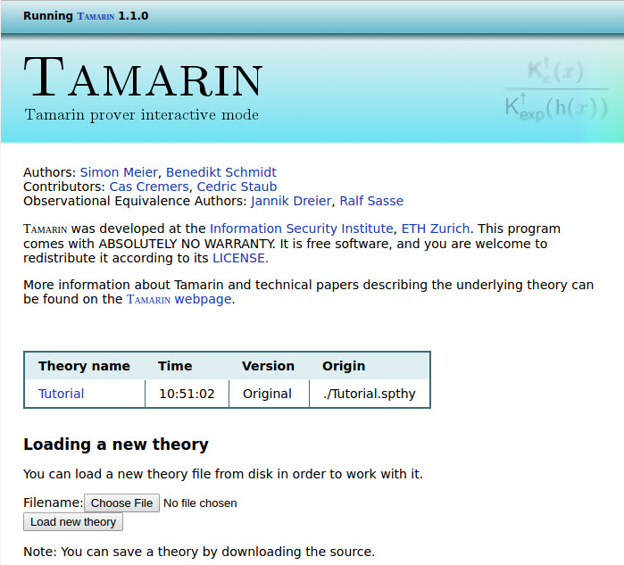

Initial Example
===============

We will start with a simple example of a protocol that consists
of just two messages, written here in Alice-and-Bob notation:

    C -> S: aenc(k, pk(S))
    C <- S: h(k)

In this protocol, a client C generates a fresh symmetric key 'k', encrypts it
with the public key of a server 'S' (`aenc` stands for *asymmetric encryption*),
and sends it to 'S'. The server confirms the key's receipt by sending its 
hash back to the client.

This protocol is a artificially simple and satisfies only very weak security
guarantees.  We will use it to illustrate the general Tamarin workflow
by proving that, from the client's perspective, the freshly
generated key is secret provided that the server is uncompromised.

The protocol's Tamarin model and its security properties are given in 
the file [Tutorial.spthy](code/Tutorial.spthy) (`.spthy` stands for *security 
protocol theory*). The Tamarin file starts with `theory` followed by the 
theory's name, here `Tutorial`.  

~~~~ {.tamarin slice="code/Tutorial.spthy" lower=12 upper=13}
~~~~

After the keyword `begin`, we first declare function symbols and the
equations that these functions satisfy. The functions and equations
describe the cryptographic primitives used in the protocol and their
properties. Afterward, we declare multiset rewriting rules that model
the protocol and finally we write the properties to be proven (called
`lemmas'), which specify the protocol's desired security properties.
Note that we have also inserted comments to structure the theory.

We next explain in detail the protocol modeled above.

Function Signature and Equational Theory
----------------------------------------

We are working in a symbolic model of security protocols.  This means
that we model messages as terms, built from functions, that satisfy
an underlying equational theory. This will be explained in detail later.
But note for now that there are function names, which we explicitly
declare together with their arity, and equalities that define the
semantic equivalence of terms, e.g., the decryption of an encrypted
ciphertext is the original message when the correct keys are used. We
generally use lower-case for function names.

As an example,
we model hashing using the unary function 'h'
and we model asymmetric encryption by giving declarations for:

  * a binary function 'aenc' denoting the asymmetric encryption algorithm,
  * a binary function 'adec' denoting the asymmetric decryption algorithm, and
  * a unary function 'pk' denoting the public
  key corresponding to a private key.

This is done by declaring the function symbols:

~~~~ {.tamarin slice="code/Tutorial.spthy" lower=15 upper=15}
~~~~

The equation 

~~~~ {.tamarin slice="code/Tutorial.spthy" lower=16 upper=16}
~~~~

models the interaction between calls to these three function symbols
by specifying that the decryption of the cyphertext using the correct private key returns the 
initial plaintext. For more details on user-specified equations, see the section 
on [Cryptographic Messages](004_cryptographic-messages).

Modeling a Public Key Infrastructure
--------------------------------------

In Tamarin, the protocol and its environment are modeled using *multiset 
rewriting rules*. The rules operate on the system's state expressed as a 
multiset of facts. Facts can be seen as predicates storing state information. 
For example, the fact `Out(h(k))` models that the protocol sent out the message 
`h(k)` on the public channel.

The example starts with the model of a public key infrastructure (PKI). Again, 
we use facts to store information about the state given by their arguments. The rules 
have a premise and a conclusion, separated by the arrow symbol `-->`. Executing the 
rule requires that all facts in the premise are present in the current state 
and, as a result of the execution, the facts in the conclusion will be added to 
the state, while the premises are removed. Now consider the first rule, 
modeling the registration of a public key:

~~~~ {.tamarin slice="code/Tutorial.spthy" lower=19 upper=22}
~~~~

Here the only premise is an instance of the `Fr` fact. The `Fr` fact is
a built-in fact that denotes a freshly generated fresh name, which is used to
model random numbers such as nonces or keys. See later in this manual
for further details. *CAN WE GIVE A REFERENCE HERE.  I.E. "See Section ... for
further details"*

In Tamarin, the sort of variable is expressed using prefixes:

 *    `~x`  denotes  `x:fresh`
 *    `$x`  denotes  `x:pub`
 *    `#i`  denotes  `i:temporal`
 *    `i`   denotes  `i:msg`

Moreover, a string constant `'c'` denotes a public name `'c \in PN'`, which is
a fixed, global constant.

The above rule can therefore be read as follows. First, freshly generate
a fresh name `~ltk` of sort fresh, which is the new private key, and
nondeterministically choose a public name `A`, the agent for which we
are generating the key-pair.  Afterward, generate the fact `!Ltk($A, ~ltk)`
(`!` denotes that it is persistent, i.e., cannot be consumed), which
denotes the association between agent `A` and its private key `~ltk`,
and generate the fact `!Pk($A, pk(~ltk))`, which denotes the association
between the agent `A` and its public key `pk(~ltk)`.

In the example, we allow the adversary to retrieve any public key using the 
following rule. Intuitively, it just reads a public-key database entry and
sends the public key to the network using the built-in fact `Out`
denoting a message sent to the network (see the section on protocol 
specification for more information):

~~~~ {.tamarin slice="code/Tutorial.spthy" lower=24 upper=27}
~~~~

We model the dynamic compromise of long-term private keys using the
following rule. Intuitively, it reads a private-key database entry and
sends it to the adversary. This rule has an observable `LtkReveal`
action stating that the long-term key of agent `A` was compromised. Action facts 
are just like facts, but instead of the other facts do not appear in state, 
but only on the trace. The security properties are specified on the traces, and 
the action `LtkReveal` is used below to determine which agents are compromised. 
The rule now has a premise, conclusion, and action facts within the arrow: `--[ 
FACT ]->`:

~~~~ {.tamarin slice="code/Tutorial.spthy" lower=29 upper=32}
~~~~

Modeling the protocol
----------------------

Recall the Alice-and-Bob notation of the protocol we want to model:

    C -> S: aenc(k, pk(S))
    C <- S: h(k)

We model it using the following three rules.

~~~~ {.tamarin slice="code/Tutorial.spthy" lower=34 upper=65}
~~~~

First of all note that Tamarin uses C-style comments, so everything between 
`/*` and `*/` or the line following `//` is a comment. 

The first rule models the client sending its message, while the second
rule models it receiving a response. The third rule models the server,
both receiving the message and responding in one single rule.

We also model that the server explicitly checks that the first
component of the request is equal to `'1'`. We model this by logging
the claimed equality and then adapting the security property such that
it only considers traces where all `Eq` actions occur with two equal
arguments.

Note that we log the session-key setup requests received by servers using an 
action to allow formalizing the authentication property for the client later on.

Modeling the security properties
--------------------------------

The security properties are defined over traces of the action facts of
a protocol execution.

First, we specify an additional axiom that restricts the set of considered 
traces. In this example, we restrict our attention to traces where all equality 
checks succeed. In detail the following axiom says that for all parameters `x`, 
`y` to the `Eq` action fact at some time point `i` it has to be the case that 
`x=y`.

~~~~ {.tamarin slice="code/Tutorial.spthy" lower=68 upper=68}
~~~~

Note that the order between axioms and lemmas does not matter. All
axioms are always available/assumed in the proofs of all security
properties. Now we have two lemmas, the first on the secrecy of
session key secrecy from the client point of view. The lemma
`Client_session_key_secrecy` says that it cannot be that a client has
set up a session key `k` with a server `S` and the adversary learned
that `k` unless the adversary performed a long-term key reveal on the
server `S`. The second lemma `Client_auth` specifies client authentication, 
which is that for all session keys `k` that the clients have setup with a
server `S` there must be a server that has answered the request, or
the adversary has performed a long-term key reveal on `S` previously
in time.

~~~~ {.tamarin slice="code/Tutorial.spthy" lower=70 upper=94}
~~~~

Note that we can also strengthen the authentication property to a version of
injective authentication. Our formulation is stronger than the standard
formulation of injective authentication, as it is based on uniqueness instead
of counting. For most protocols that guarantee injective authentication one
can also prove such a uniqueness claim, as they agree on appropriate fresh
data. This is shown in lemma `Client_auth_injective`.

~~~~ {.tamarin slice="code/Tutorial.spthy" lower=96 upper=110}
~~~~

To ensure that our lemmas do not just hold vacuously because the model
is not executable, we also include an executability lemma that shows that the 
model can run to completion. This is given as a regular lemma, but with the 
`exists-trace` keyword, as seen in the lemma `Client_session_key_honest_setup` 
below. This keyword says that the lemma is true if there *exists* a trace on 
which the formula holds, in contrast to the previous lemmas where we required 
the formula to hold on *all* traces.

~~~~ {.tamarin slice="code/Tutorial.spthy" lower=112 upper=117}
~~~~

Note that when adding inconsistent axioms, you can prove any property. To check 
that there still exist traces, we always want an `exists-trace` lemma. When 
modeling protocols such existence proofs are very useful sanity checks.

Graphical User Interface
------------------------

Just call

    tamarin-prover interactive Tutorial.spthy

you will then see the following output on the command line

    GraphViz tool: 'dot'
     checking version: dot - graphviz version 2.39.20150613.2112 (20150613.2112). OK.
    maude tool: 'maude'
     checking version: 2.7. OK.
     checking installation: OK.
    
    The server is starting up on port 3001.
    Browse to http://127.0.0.1:3001 once the server is ready.
    
    Loading the security protocol theories './*.spthy' ...
    Finished loading theories ... server ready at 
    
        http://127.0.0.1:3001

    21/Jun/2016:09:16:01 +0200 [Info#yesod-core] Application launched @(yesod_83PxojfItaB8w9Rj9nFdZm:Yesod.Core.Dispatch ./Yesod/Core/Dispatch.hs:157:11)

If there were any syntax or wellformedness errors (for example if the same fact 
is used with different arities an error would be displayed) you would see them 
at this point, but there are none in the 'Tutorial'. See later for details on 
how to deal with such errors.
    
This will start a web-server that loads all security protocol theories in the
same directory as Tutorial.spthy. Point your browser to

<http://localhost:3001>

and you will see the following welcome screen:

The table in the middle shows all loaded theories. You can either click on a 
theory to explore it and prove your security properties, or upload further 
theories using the upload form below.

If you click on the 'Tutorial' entry in the table of loaded theories, you 
should see the following:

On the left hand side you see the theory: links to the message theory 
describing the intruder, the multiset rewrite rules and axioms describing your 
protocol, and the typed and untyped case distinctions, followed by the lemmas 
you want to prove. We will explain each of these points in the following.

On the right hand side, you have a quick summary of the available
commands and keyboard shortcuts you can use to navigate inside the
theory. In the top right corner there are some links: `Index` leads
back to the welcome page, `Download` allows you to download the
current theory (including partial proofs if they exist), `Actions` and
then the sub-bullet `Show source` shows the source code of the theory,
and `Options` allows you to configure the level of details in the
graph visualisation (see below for examples).

If you click on `Message theory` on the left, you should see the following:

 
On the right side you can now see the message theory, starting with
the so-called *Signature*, i.e., all functions and equations you
defined. Note that Tamarin automatically added a function `pair` to
create pairs, and functions `fst` and `snd` together with two
equations to access the first and second value of a pair. There is a
shorthand for the `pair` using `<` and `>` which is used here for
example for `fst(<x.1, x.2>)`.

Just below you have the *Construction rules* which describe which functions the 
intruder can apply. Consider for example the following rule:

    rule (modulo AC) ch:
     [ !KU( x ) ] --[ !KU( h(x) ) ]-> [ !KU( h(x) ) ]

Essentially this rule says that if the intruder knows `x` (represented
by the fact `!KU(x)` in the premise), then he can compute `h(x)`
(represented by the fact `!KU(h(x))` in the conclusion), i.e., the
hash of `x`. The action fact `!KU(h(x))` in the label also notes this
for reasoning purposes.

Finally, there are the *Deconstruction rules* which describe which terms the 
intruder can extract from larger terms by applying functions. Consider for 
example the following rule:

    rule (modulo AC) dfst:
     [ !KD( <x.1, x.2> ) ] --> [ !KD( x.1 ) ]

In a nutshell this rule says that if the intruder knows the pair `<x.1, x.2>` 
(represented by the fact `!KD( <x.1, x.2> )`), then he can extract the first 
value `x.1` (represented by the fact `!KD( x.1 )`) from it. This stems from 
the applying `fst` to the pair and then using the equation 
`fst(<x.1, x.2>) = x.1`. The precise difference between `!KD( )` and `!KU( )` 
facts is not important for now, and will be explained below. As a first 
approximation, both represent they intruder's knowledge and are only used to 
make the tool's reasoning more efficient.

Now click on *Multiset rewriting rules and axioms* on the left.

On the right side of the screen you should now see your protocol's 
rewriting rules, plus two additional rules: the `isend` and `irecv` rules, 
which interface the protocols output and input with the intruder deduction.
The rule `isend` takes a fact `!KU(x)`, i.e., a value `x` the intruder knows, 
and passes it to a protocol input `In(x)`. The rule `irecv` takes a protocol 
output `Out(x)` and passes it to the intruder knowledge, represented by the 
`!KD(x)` fact. Note that the rule `Serv_1` from the protocol has three 
*variants (modulo AC)*. The precise meaning of this is not important right now 
(it stems from the way Tamarin deals with equations) and will be explained in 
the [section on cryptographic
messages](004_cryptographic-messages.html#sec:cryptographic-messages).

Just below you have the list of all axioms. In this example there is
only the one axiom `Equality_Checks_Succeed`.

Now click on `Untyped case distinctions (10 cases, all chains solved)` to see 
the following:

 
To improve the efficiency of its internal reasoning, Tamarin precomputes case 
distinctions. A case distinction gives all possible sources for a fact, i.e., 
all rules (or combinations of rules) that produce this fact, and can then be 
used during Tamarin's backward search. These case distinctions are 
then used to avoid computing the same thing again and again. On the right hand 
side you can now see the result of the precomputations for our Tutorial theory.

For example, here Tamarin tells us that there is one possible source of the 
fact `!Ltk( t.1, t.2 )`, namely the rule `Register_pk`. The image shows the 
(incomplete) graph representing the execution. The green box symbolizes the 
instance of the `Register_pk` rule, and the trapezoid on the bottom stands for 
the "sink" of the `!Ltk( t.1, t.2 )` fact. Here the case distinction consists 
of only one rule instance, but there can be potentially multiple rule 
instances, and multiple cases inside the case distinction, as in the following 
images.

The technical information given below the image is not important for now, it 
gives details about how the case distinction was computed and if there are 
other constraints such as equations or substitutions which still need to be 
resolved.

 
Here the fact `!KU( ~t.1 )` has three sources, the first one is the rule 
`Reveal_ltk`, which requires an instance of the rule `Register_pk` to create 
the necessary `!Ltk` fact. The other two sources are given below.
 

 
Now we will see how to prove lemmas in the interactive mode. For that, click on 
the `sorry` (indicating that the proof has not been started) after the first 
lemma in the left frame to obtain the following screen:

Tamarin proves lemmas using constraint solving, i.e., by refining the knowledge 
it has about the property and the protocol (called a *constraint system*) until 
it can either conclude that the property holds in all possible cases, or until 
it finds a counterexample invalidating the lemma.

On the right we now have the possible proof steps at the top, and the current 
state of the constraint system just below (which is empty, as we haven't 
started the proof yet). A proof always starts with either a simplification step 
(`1. simplify`) which translates the lemma into an initial constraint system 
that needs to be resolved, or an induction setup step (`2. induction`) which 
generates the necessary constraints to prove the lemma using induction on the 
length of the trace. Here we use the default strategy, i.e., a simplification 
step by clicking on `1. simplify`, to obtain the following screen:
 

Tamarin has now translated the lemma into a constraint system. Since it looks 
for counterexamples to the lemma, it looks for a protocol execution that 
contains a `SessKeyC( S, k )` and a `K( k )` action, but does not use an 
`LtkReveal( S )`. This is visualized in the graph as follows. The only way of 
getting a `SessKeyC( S, k )` action is using an instance of the `Client_2` 
rule on the left, and the `K( k )` rule is symbolized on the right using a 
round box (intruder reasoning is always visualized using round boxes).
Just below the graph, the formula

    formulas: ∀ #r. (LtkReveal( S ) @ #r) ⇒ ⊥

now states that any occurrence of `LtkReveal( S )` will lead to a contradiction.

To finish the proof we can either continue manually by selecting the constraint 
to resolve next, or by calling the `autoprove` command which selects the next steps 
based on a heuristic. Note that that the proof methods in the GUI are also 
sorted according to the same heuristic. Always selecting the first proof method 
will result in the same proof as the one constructed by the 'autoprover'.

In both cases we end with the following final state, where the constructed 
graph leads to a contradiction as it contains `LtkReveal( S )`:

 
The lemma is now colored in green, as it was successfully proven. If we had 
found a counterexample, it would be colored in red. You can prove the other 
lemmas in the same way.

Running Tamarin on the Command Line
-----------------------------------

The call

    tamarin-prover Tutorial.spthy

parses the `Tutorial.spthy` file, checks its wellformedness, 
and pretty-prints the theory. The declaration of the signature and the 
equations can be found at the top of the pretty-printed theory.

Proving all lemmas contained in the theory using the automatic prover is as 
simple as adding the flag `--prove` to the call; i.e.,

    tamarin-prover Tutorial.spthy --prove

This will first output some logging from the constraint solver and
then the Tutorial security protocol theory with the lemmas and their
attached (dis)proofs:

    summary of summaries:
    
    analyzed: Tutorial.spthy
    
      Client_session_key_secrecy (all-traces): verified (5 steps)
      Client_auth (all-traces): verified (11 steps)
      Client_auth_injective (all-traces): verified (15 steps)
      Client_session_key_honest_setup (exists-trace): verified (5 steps)

Complete Example
----------------

Here is the complete input file:

~~~~ {.tamarin include="code/Tutorial.spthy"}
~~~~
