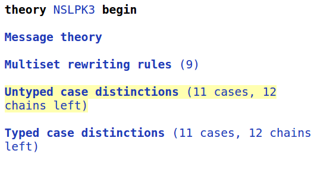

Precomputation
============== 

To better understand the precomputation of Tamarin and how it can
cause [open chains](#sec:openchains) and how they are problematic, let
us look at the example of the Needham-Schroeder-Lowe Public Key
Protocol.

~~~~ {.tamarin slice="code/NSLPK3.spthy" lower=24 upper=29}
~~~~

It is specified in Tamarin by the following rules:

~~~~ {.tamarin slice="code/NSLPK3.spthy" lower=32 upper=71}
~~~~

We want to examine if the following lemma holds:

~~~~ {.tamarin slice="code/NSLPK3.spthy" lower=105 upper=118}
~~~~

Open Chains {#sec:openchains}
-----------

In the precomputation phase, the Tamarin prover goes through all rules
and computes from what chain of rules the premise of this rule could
have been derived.

However, for some rules the Tamarin prover cannot resolve where a fact must
have come from. We call this an open chain.

Typically with open chains automatic proofs cannot be found.
For this reason, it is good to find open chains and remove them.

In the interactive mode you can find open chains as follows.
On the top left, under "Untyped case distinction", you can find the chains
that were precomputed by Tamarin.

The unsolved chains can be identified by the light green arrows as in the
following example:

The green arrow indicates that the Tamarin prover thinks that the adversary can
derive any fresh term `~t.1` with this rule `I_2`. 
As we are using an untyped protocol model, the tool does not see that `nr.7`
should be a fresh nonce, but interprets it to be any message. For this reason
Tamarin concludes that it can derive any message with this rule.

To get a better understanding of the problem we can look at what happens if
Tamarin wants to prove the lemma `nonce_secrecy`.
If we manually always choose the first case for the proof, we can see that 
Tamarin derives the secret key to decrypt the output of rule `I_2` by
repeatedly using this rule `I_2`.

As it thinks that it can derive any message with the rule `I_2`,
Tamarin derives the secret key that is needed. The proof uses the same
strategy recursively but will not terminate.

Typing Lemmas to Mitigate Open Chains
-------------------------------------

Once we identified the rules and cases in which open chains occur, we
can try to avoid them. Typically, we want to do this with typing
lemmas.

Typing lemmas are a special case of lemmas. The statement of the
typing lemma will be assumed when proving the other lemmas, like a
`[reuse]` lemma. Also, typing lemmas always use induction.  In our
example we can add the following lemma:

~~~~ {.tamarin slice="code/NSLPK3.spthy" lower=86 upper=102}
~~~~

This lemma is applied to the untyped case distinctions to compute the
typed case distinctions. All non-typing lemmas are proven with the
resulting typed case distinctions, while typing lemmas of course need
to be proved with the untyped case distinctions.

This lemma relates the point of instantiation to the point of sending
by either the adversary or the communicating partner. In other words,
it says that whenever the responder receives the first nonce, either
the nonce was known to the adversary or the initiator sent the first
message prior to that moment. Similarly, the second part states that
whenever the initiator receives the second message, either the
adversary knew the corresponding nonce or the responder has sent the
second message before.

This typing lemma can be automatically proven by Tamarin. With the
typing lemma, Tamarin can then automatically prove the lemma
`nonce_secrecy`.

Another possibility is that the open chains only occur in an undesired
application of a rule that we do not want to consider in our model.
In such a case we can explicitly exclude this application of the rule
with an axiom. But, we need to ensure that the resulting model is the
one we want, so use this with care.

